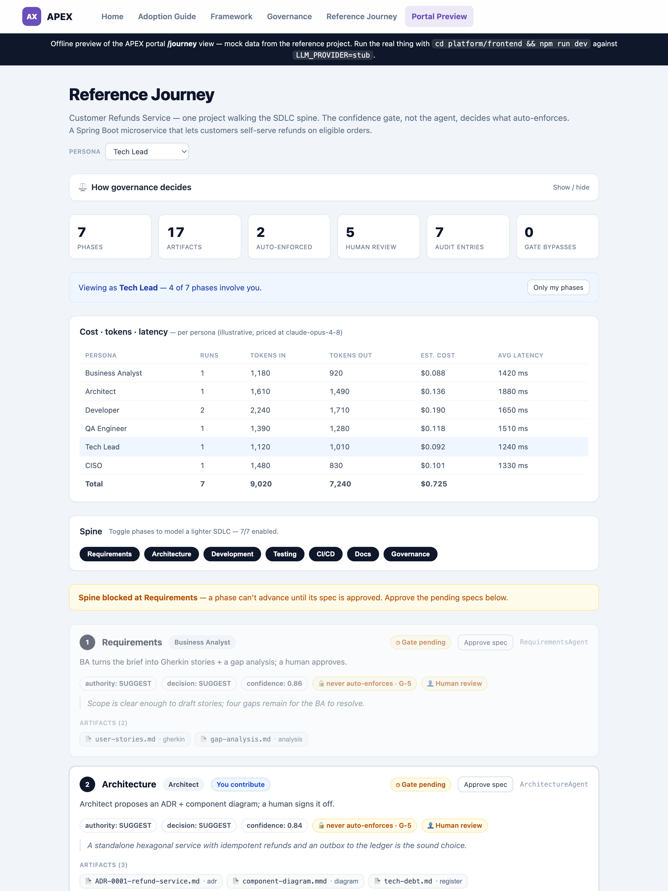

# APeX SDLC

[](LICENSE)
[](platform/backend/pyproject.toml)
[](platform/backend)
[](platform/frontend)
[](platform/backend/tests)
[](https://github.com/doubts-suplab/agent-harness)
[](docs/progress.md)

## AI-Powered Engineering eXperience — Enterprise SDLC Augmentation Plan

APEX is a non-intrusive AI augmentation layer that sits alongside your existing SDLC without replacing any tooling or ceremony. It routes the right AI capability to the right persona at the right stage of delivery — developers get Claude Code and Copilot in their IDEs, BAs and PMs get prompt-powered Confluence and Jira automation, testers get AI-generated test suites, and leadership gets AI-synthesized status reports.

As it has matured, APEX has grown from an augmentation *plan* into a runnable *platform* (`platform/`): per-phase AI agents that generate real artifacts, all running on the generic [**agent-harness**](https://github.com/doubts-suplab/agent-harness) runtime. APEX does **not** re-implement agent execution — the harness owns the confidence gate, the tool registry, audit, human-review routing, and safe-failure defaults; APEX supplies the agents and the infrastructure adapters.

> **See it end to end:** the [**reference journey**](examples/reference-project/README.md) walks one project (a Customer Refunds Service) through all seven SDLC phases and seven personas, offline, producing 17 real artifacts — regenerate it any time with `cd platform/backend && LLM_PROVIDER=stub python -m app.demo.reference_journey`.

**Core principles:**
- Zero new tools for non-engineering personas
- **AI generates drafts; humans approve and commit** — enforced by the harness authority ladder, not by convention (SUGGEST-authority phases can never auto-enforce; see [`docs/personas.md`](docs/personas.md))
- Every AI action is logged, audited, and governed
- Adopt incrementally — one team, one sprint, one phase at a time

**Expected outcomes at 6 months:**
- 30–40% reduction in PR cycle time
- 50%+ reduction in boilerplate code authoring time
- 60% reduction in manual test case writing effort
- Near-zero undocumented COBOL programs (legacy modernisation)
- Consistent story quality scores across all squads

---

## Quick start for evaluators (offline — no keys, no Docker)

APEX runs end-to-end offline on a deterministic stub model. One command regenerates the entire governed
reference journey — no API keys, database, or containers required:

```bash
make install     # one-time: create the backend venv + install (needs Python 3.11+)
make journey     # walk one project through all 7 SDLC phases, governed, offline
```

**What you get:** [`examples/reference-project/`](examples/reference-project/README.md) — **17 real
artifacts** (Gherkin stories, ADRs, a PR review, a test plan, release notes, docs, an audit report)
produced by the seven phase agents running on the governed [agent-harness](https://github.com/doubts-suplab/agent-harness),
plus a machine-readable `journey.json`. Every artifact is generated by the harness, not hand-written.

```bash
make gate-report   # show the spec-driven spine blocking until each spec is approved
make smoke         # regenerate all fixtures, assert examples/ byte-identical, run governance tests
make help          # list every offline demo + check target
```

Prefer raw commands, or want the API/frontend? See [**Try it**](#try-it) below.

---

## See the portal — offline

The reference journey rendered in the portal UI — the **governance model** (the G-5 rule + per-phase
confidence thresholds), the per-persona **cost / token / latency** dashboard, the **configurable spine**
picker, the spec-driven **gates**, and a per-artifact content viewer. The image below is a static snapshot
of [`docs/portal-preview.html`](docs/portal-preview.html) — an **offline, interactive** replica (mock data,
no backend). Open that file in a browser to click around, or run the real portal with
`cd platform/frontend && npm run dev` against a backend on `LLM_PROVIDER=stub`.

<p align="center">
  <a href="docs/portal-preview.html">
    
  </a>
</p>

---

## What works today vs. planned

APEX is **demonstrable and governed end-to-end offline**; the production *substance* (real generation,
write-back, persistence, enforced gates on live infra) is deliberately tracked as ahead of us. This table
is the headline; [`docs/progress.md`](docs/progress.md) is the increment-by-increment truth and
[`ROADMAP.md`](ROADMAP.md) is the plan. Legend: ✅ built · 🚧 partial (offline built, live pending) · ❌ planned.

| Capability | Status | Notes |
|---|---|---|
| Seven governed phase agents + reference journey | ✅ | On the agent-harness; offline, deterministic, 17 artifacts |
| Persona/phase catalog (single source of truth) | ✅ | [`docs/personas.md`](docs/personas.md) ↔ `app/agents/catalog.py` |
| Phase-gate engine (spec-driven spine) | 🚧 | Pure engine + API + UI offline; DB persistence of evaluations pending |
| Onboarding via eeik (bridge, scaffold, repo-tree) | 🚧 | Deterministic bridge + repo-tree emission; real GitHub repo creation pending |
| Real LLM generation | 🚧 | Path wired via `PhaseAgent.generate()`; real output needs a configured provider |
| Artifact persistence + version lineage | 🚧 | DB persistence built (SQLite-verified); S3 storage pending |
| Cost / token / latency metering + dashboard | 🚧 | Per-persona metering + frontend dashboard; time-series rollups pending |
| Auth & persona RBAC | 🚧 | HS256 JWT + `require_persona`; global middleware opt-in; credential store pending |
| PII guard on agent I/O | 🚧 | Regex guard wired + `pii_events` persisted; Comprehend NLP layer pending |
| Governance persistence (audit / PII / policy) + CISO view | 🚧 | Tables populated on persist + CISO-gated API + frontend panel |
| Live integrations + webhooks (GitHub/Jira/Confluence) | 🚧 | Config-driven live adapters + signature-verified webhooks + dispatch router |
| Agent write-back (create Jira story, PR review, publish) | 🚧 | Governed tool-call path built offline; real credentialed adapters pending |
| AWS deploy (CDK: ECS Fargate, Aurora, S3) | ❌ | Planned (Phase 5) |

> The highest-leverage next step is the [**First Production Slice (V1)**](ROADMAP.md#priority-initiative--first-production-slice-vertical-v1):
> one project end-to-end on real infra — the antidote to staying in "impressive offline demo" territory.

---

## 2. Framework Architecture

```
┌───────────────────────────────────────────────────────────────────────┐
│                        APEX FRAMEWORK LAYERS                          │
├───────────────────────────────────────────────────────────────────────┤
│  PERSONA LAYER                                                        │
│  Dev (IDE)  │  BA/PM (Claude.ai)  │  Tester (CLI)  │  Stakeholder     │
├───────────────────────────────────────────────────────────────────────┤
│  AI ORCHESTRATION LAYER                                               │
│  Claude Code CLI  │  Copilot API  │  Claude API (Haiku/Sonnet)        │
├───────────────────────────────────────────────────────────────────────┤
│  INTEGRATION LAYER                                                    │
│  Jira  │  Confluence  │  GitHub  │  SonarQube  │  Slack/Teams         │
├───────────────────────────────────────────────────────────────────────┤
│  GOVERNANCE LAYER                                                     │
│  Audit Log  │  Policy Engine  │  PII Guard  │  Approval Gates         │
├───────────────────────────────────────────────────────────────────────┤
│  DATA LAYER                                                           │
│  CLAUDE.md files  │  Prompt Library  │  Metrics Store                 │
└───────────────────────────────────────────────────────────────────────┘
```

---

## 3. How a project flows through APEX

APEX is **onboarding-first and spec-driven**. A project is first **onboarded** — eeik's generators scaffold
the repo, `CLAUDE.md`, capability packs, and standards, and APEX registers it — and from there a governed,
**spec-driven spine** runs: each SDLC phase produces an artifact ("spec") that a human approves before the
next phase proceeds (the generalisation of a spec-driven IDE's `requirements → design → tasks` chain to the
seven APEX phases). See [`ROADMAP.md`](ROADMAP.md#product-vision--onboarding-first-spec-driven) for the
vision and [`docs/progress.md`](docs/progress.md) for an honest built-vs-planned status.

Onboarding **consumes the real eeik engine** when it is installed: manifest validation (eeik's canonical
schema) and capability-pack resolution run through eeik itself — in-process via the **SDK** (`import eeik`)
or over **MCP** (`eeik mcp`) — instead of APEX's vendored copy. It falls back to the vendored offline path
when eeik is absent, so APEX still onboards standalone. See
[`app/onboarding/eeik_engine.py`](platform/backend/app/onboarding/eeik_engine.py) and
`python -m app.demo.eeik_engine_demo`.

Every SDLC phase is owned by a persona and run by an AI agent on the governed harness. The agent
**proposes** a decision; the harness **decides** whether it may auto-enforce. The single source of truth
for this mapping is [`docs/personas.md`](docs/personas.md) (mirrored by
`platform/backend/app/agents/catalog.py`).

| Phase | Persona | Agent | Authority | Typical governed outcome |
|---|---|---|---|---|
| Requirements | Business Analyst | `RequirementsAgent` | SUGGEST | → human review (AI drafts, human approves) |
| Architecture | Architect | `ArchitectureAgent` | SUGGEST | → human review |
| Development | Developer | `PRReviewerAgent` | ALERT | auto-enforced advisory when confident |
| Testing | QA Engineer | `QAAnalystAgent` | SUGGEST | → human review |
| CI/CD | Tech Lead | `ReleaseEngineerAgent` | RATE_LIMIT | auto-enforced release when checks are green |
| Docs | Developer | `TechWriterAgent` | SUGGEST | → human review |
| Governance | CISO | `ComplianceOfficerAgent` | BLOCK | auto-block only at ≥ 0.95; else human review |

The **Program Manager** persona is cross-cutting (portfolio view: phase status, gate health, agent cost).

**The founding principle is enforced, not asserted.** The four SUGGEST-authority phases *cannot*
auto-enforce (harness gate rule G-5), so they always route to a human — "AI generates drafts; humans
approve" is a property of the authority ladder, not a coding convention.

### Try it

```bash
# 1. Regenerate the reference journey offline (no API keys, no DB)
cd platform/backend
python -m venv .venv && . .venv/bin/activate && pip install -e .
LLM_PROVIDER=stub python -m app.demo.reference_journey     # writes examples/reference-project/artifacts/**

# 2. Serve the same journey over the API
DATABASE_URL=postgresql+asyncpg://x:x@localhost/x REDIS_URL=redis://localhost:6379/0 \
  SECRET_KEY=dev LLM_PROVIDER=stub uvicorn app.main:app
#    GET /api/v1/journey/reference           → the full governed walk
#    GET /api/v1/journey/reference?persona=ciso  → filtered to one persona

# 3. Run the governance tests (the harness governs every phase)
pytest --noconftest tests/agents/
```

The frontend surfaces the same walk at `/journey`, filtered by the persona switcher.

## Documentation map

| Doc | What it is |
|---|---|
| [`docs/personas.md`](docs/personas.md) | The 7 personas × 7 phases catalog — single source of truth |
| [`examples/reference-project/`](examples/reference-project/README.md) | The runnable reference journey + committed artifacts |
| [`docs/reference-journey.html`](docs/reference-journey.html) | The reference journey rendered visually |
| [`docs/portal-preview.html`](docs/portal-preview.html) | Offline, interactive replica of the portal UI (mock data) |
| [`docs/APEX-Framework.md`](docs/APEX-Framework.md) | The full framework document |
| [`CONTRIBUTING.md`](CONTRIBUTING.md) | How to set up, the offline-green workflow, and conventions |
| [`ROADMAP.md`](ROADMAP.md) | The 5-phase platform build plan |
| [`platform/CLAUDE.md`](platform/CLAUDE.md) | Platform architecture for AI agents |
| [`prompts/`](prompts/) | Prompt library per persona (all 7 covered) |
